# Travel App 🛫🏨🚗

A Flutter application that supports hotel booking, attraction discovery, car rentals, travel news, and user profile management.  
The project is organized using a **Model + View (UI)** structure with reusable components grouped by feature.

---

## 📂 Project Structure

```
lib/
├── firebase_options.dart        # ⚙️ Firebase configuration
├── main.dart                    # 🚀 Application entry point
│
├── components/                  # 🧩 Reusable widgets
│   ├── attractions/             # 🎡 UI components for attractions
│   └── stays/                   # 🏨 UI components for hotels/stays
│
├── details_screen/              # 🔎 Detail screens
│   ├── details_attractions.dart
│   ├── details_car.dart
│   ├── details_news.dart
│   ├── detail_stays.dart
│   └── detail_travel.dart
│
├── information_screen/          # 📋 User-related information screens
│   ├── get_information_user.dart
│   ├── information_addTour.dart
│   ├── information_history.dart
│   ├── information_hotel.dart
│   └── notification_firebase.dart
│
├── models/                      # 📦 Data models (Hotel, Car, News, Attraction…)
│
├── other/                       # 📑 Miscellaneous supporting screens
│   ├── attractions/
│   └── stays/
│
├── screens/                     # 🖥️ Main application screens
│   ├── Authentication/          # 🔐 Login, Register, Forgot password
│   └── ChatBot/                 # 🤖 Chatbot support
│
└── utils/                       # 🛠️ Utilities & small custom widgets
    ├── colors.dart
    ├── image_utils.dart
    ├── loading_screen.dart
    └── custom_text.dart
```

---

## 🚀 Features
- 🔐 Authentication: login, register, forgot password (via Firebase).
- 🏨 Search and book hotels.
- 🎡 Discover and search attractions.
- 🚗 Car rental management.
- 📰 Travel news feed.
- ❤️ Manage favorites and booking history.
- 🤖 Built-in chatbot support.
- 🔔 Push notifications (Firebase).
- 🛠️ Tech Stack

## Flutter for UI
- Firebase (Authentication, Notifications)
- Dart models for data handling
- Custom Widgets for reusable UI

## ️ Getting Started

### 1.Clone the repository:
```bash
   git clone https://github.com/Vuonggba1403/BookingTourApp_Flutter
```

### 2. Install dependencies:
```bash
   flutter pub get
```

### 3. Configure Firebase:
    Add google-services.json (Android) and GoogleService-Info.plist (iOS).
    The firebase_options.dart file is pre-configured.

### 4. Run the app:
```bash
    flutter run
```

## Demo

| Login Screen | Signup Screen | Login FB Screen | Home Screen |
|--------------|---------------|----------------|------------|
| 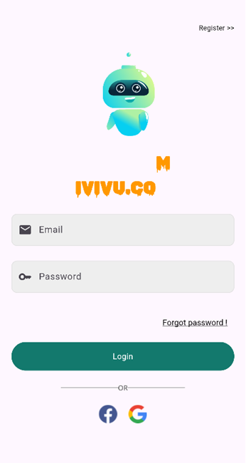 | 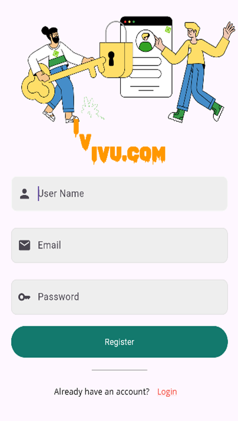 | 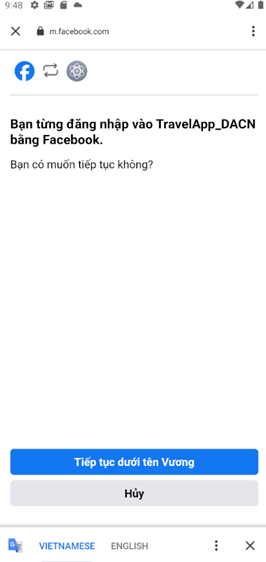 | 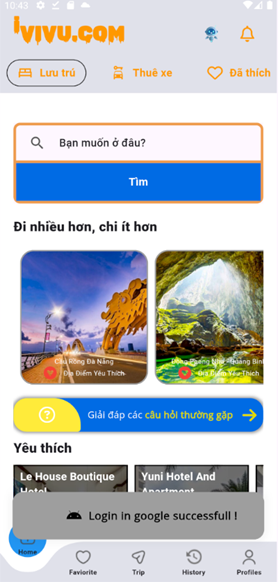 |
| Booking Car 1 | Booking Car 2 | Favorites Screen | Profile Screen |
|---------------|---------------|-----------------|----------------|
| 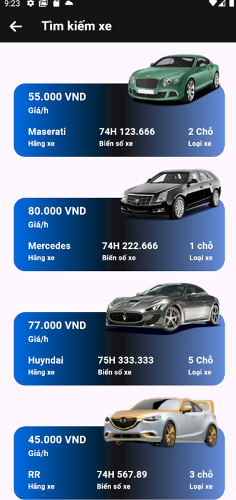 | 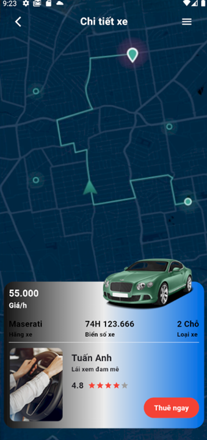 | 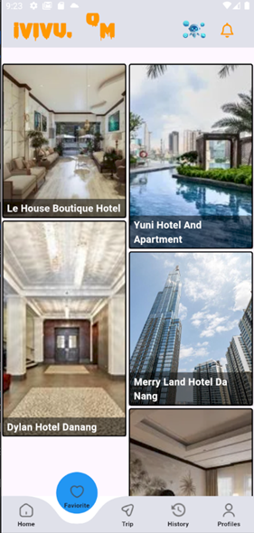 | 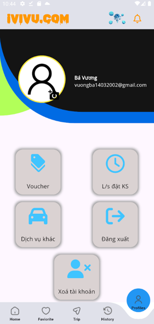 |
| Notification Screen | Search Screen | List Tours Screen | Gemini AI Chat Screen |
|--------------------|---------------|-----------------|----------------------|
| 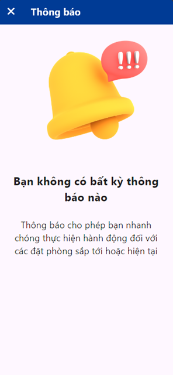 | 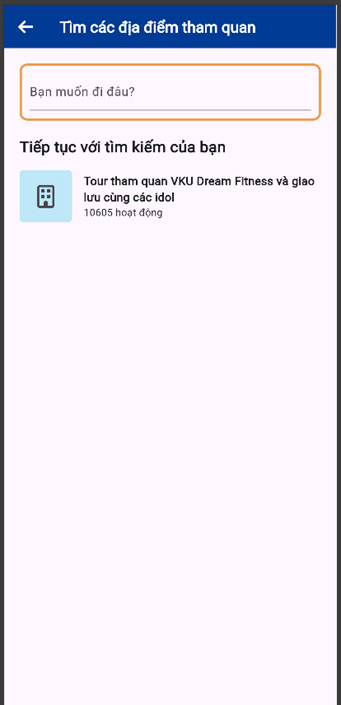 | 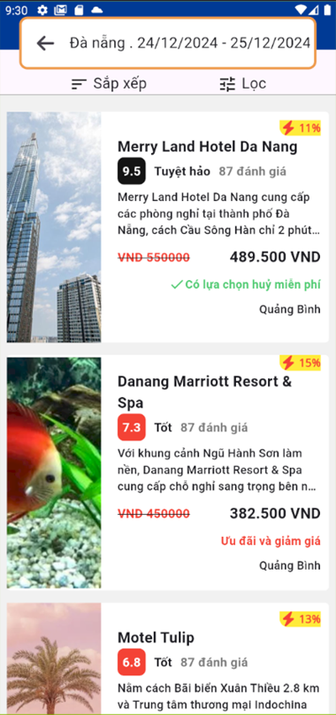 |  |
| Fantasy Trip Screen | History Checkout Screen | Booking Hotel Screen |  |
|-------------------|----------------------|--------------------| |
| 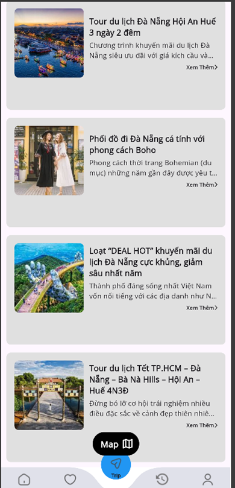 | 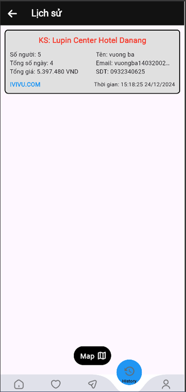 | 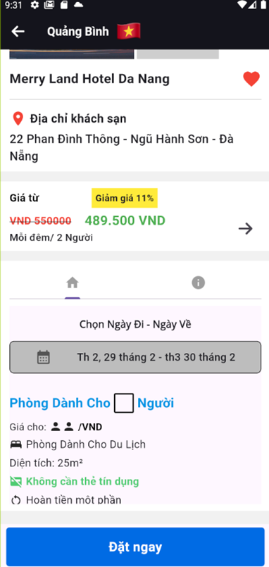 |  |


---
